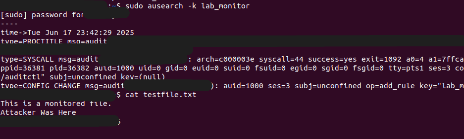
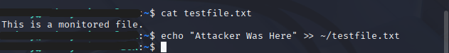

# auditd-threat-detection
Linux file monitoring and intrusion detections using auditd

This project demonstrates how to monitor and detect unauthorized file access using 'auditd' on a Linux system. It simulates a real world SOC analyst workflow, including log configuration, attack simulation, and forensic review using 'ausearch'.

##Tools Used
-Ubuntu 22.04 (Defender VM)
-Kali Linux (Attacker VM)
-auditd (Linux Audit Daemon)
-SSH, 'ausearch', 'auditctl'

##Setup Summary
1. **Install auditd** on Ubuntu Defender VM**:
 ```bash
   sudo apt install auditd audispd-plugins rsyslog -y
   ```

2. **Create a file to monitor**:
   ``` bash
   touch ~/testfile.txt
   ```

3. **Add an audit rule**:
   ```bash
   sudo auditctl -w ~/testfile.txt -p war -k lab_monitor
   ```

4. **SSH into the Ubuntu VM from KAli** and modify the file.

5. **Review logs using**:
   ```bash
   sudo ausearch -k lab_monitor
   ```

##ScreenShots
| Audit Log Detection | Simulated Attack |
|---------------------|------------------|
| |  |

##Report
Full incident write-up is available [here](report/incident_report.md)

##Skills Demonstrated
-Blue Team detection configuration
- Audit rule writing
- Log forensics with 'ausearch'
- Incident documentation
